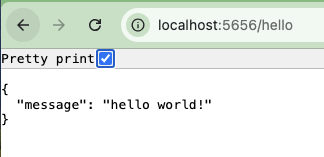
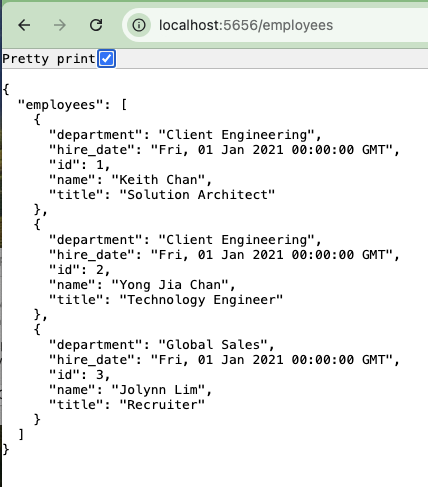

## Stack Choice
- **Web Framework**: Python/Flask 
- **Database**: PostgreSQL 
- **Environment**: The app and database are hosted locally on a Mac M1 (arm64) machine

## Prerequisites

Ensure the following tools are installed before proceeding:

- [Homebrew](https://brew.sh/)
- [Docker](https://www.docker.com/products/docker-desktop)
- [Ansible](https://docs.ansible.com/ansible/latest/installation_guide/intro_installation.html)
- [Python](https://www.python.org/downloads/)

## PostgreSQL Database Setup

1. Set up and activate the Python virtual environment:
   ```
   python3 -m venv venv
   source venv/bin/activate
   pip install psycopg2
    ```

2. Run the following Ansible playbook to install PostgreSQL:
    ```
    ansible-playbook -i inventory install-postgres.yml
    ```

3. During the playbook execution, you'll be prompted to set a password for the database user.

## Web Server Setup

1. Build the Docker image for the Flask web application:

    ```
    docker build -t hello-world .
    ```

2. Run the Docker container, ensuring you pass the password you set for the PostgreSQL user:
    ```
    docker run -e DB_PASSWORD=<your_secure_password> -p 5656:5656 hello-world
    ```

3. Access the application in your browser:
- **Hello World Endpoint**: http://localhost:5656/hello

- **Employees Endpoint**: http://localhost:5656/employees`

